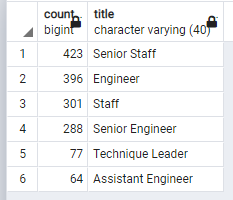

# Pewlett-Hackard-Analysis

# Overview
This was a data analysis was preformed using SQL queries to assist the client in determining how many employees will of retirement-age, their departments and their eligiability for a proposed mentorship program. 

# Summary
**List of Retiring Employees**
- The total number of retirement eligiable employees was determined by queiring employees with birthdays between January 1, 1952 and December 31, 1955 and who started work before January 1999. The total number was 112,050.

- The titles of employees what will retire was queired to deterimine there job titles. 
    - The most frequent job title was Senior Engineer with = 25,916.
    - The second most frequent title was Senior Staff = 24,926.
   

**Employees Eligable for Mentorship Program**

- When the data was queiried to determine eligibility for a mentorship program it was determined that there were 423 Senior Staff eligible, 396 Engineers, 301 with the job title Staff, 288 Senior Engineer, 77 Technique Leaders, 64 Assistant Engineers. 

# Further Analysis
- There are are many employees that will be retiring soon. Recruitment for engineers should begin immediatly as it is the most frequent job title.
- The title of "Staff" is ambiguous and would need further analysis to dertermine what jobs will have openings and where recruitment efforts should be focused. 

